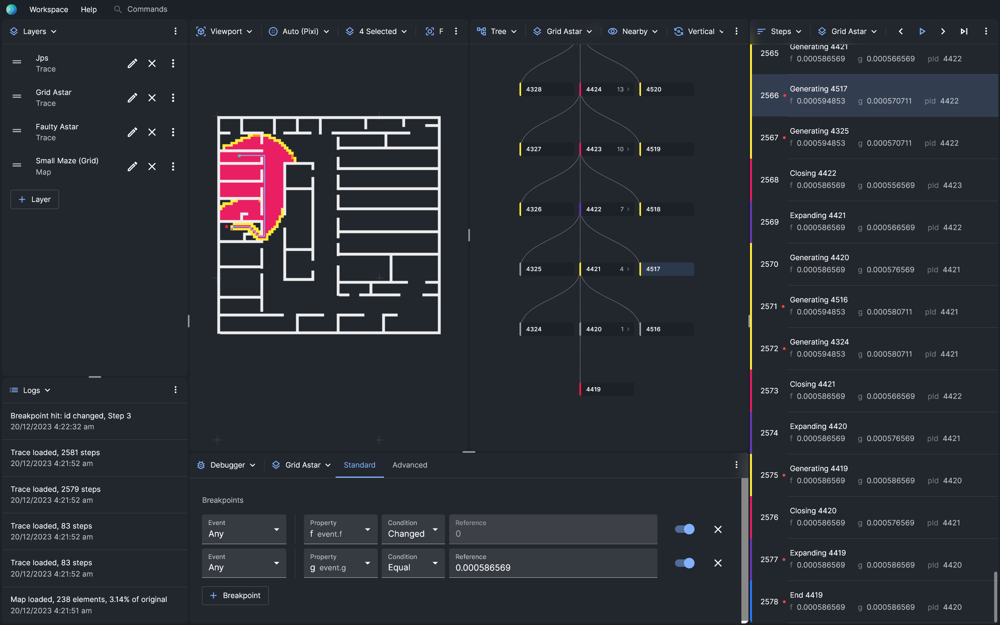

# Posthoc Visualiser

[Open Posthoc](https://posthoc.pathfinding.ai/)

**Posthoc** is a way to build quick-and-dirty visualisations ✨ for sequential decision-making algorithms, such as search algorithms 🚀.

It's easy to get started.

1. Print logs as [search traces](https://posthoc.pathfinding.ai/docs/search-trace)
2. Load those into the [Posthoc visualiser](https://posthoc.pathfinding.ai/docs/category/posthoc-visualiser)
3. Voila!

## Documentation

[View documentation](https://posthoc.pathfinding.ai)

## Changelog

[View changelog](./docs/changelog.md)

## Releases

[View releases](https://github.com/ShortestPathLab/posthoc-app/releases)
