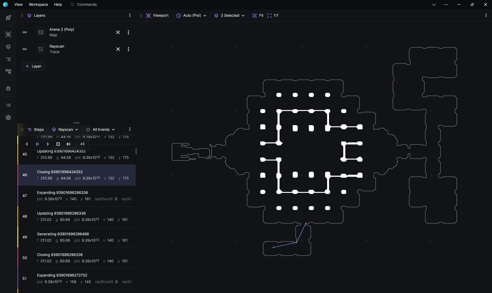
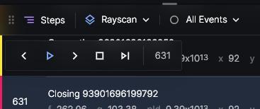
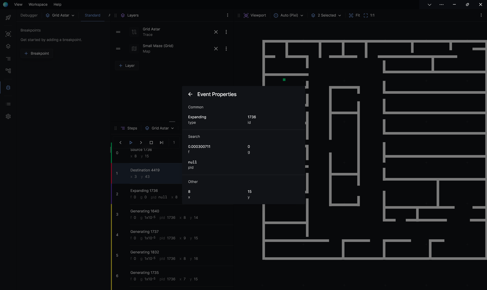
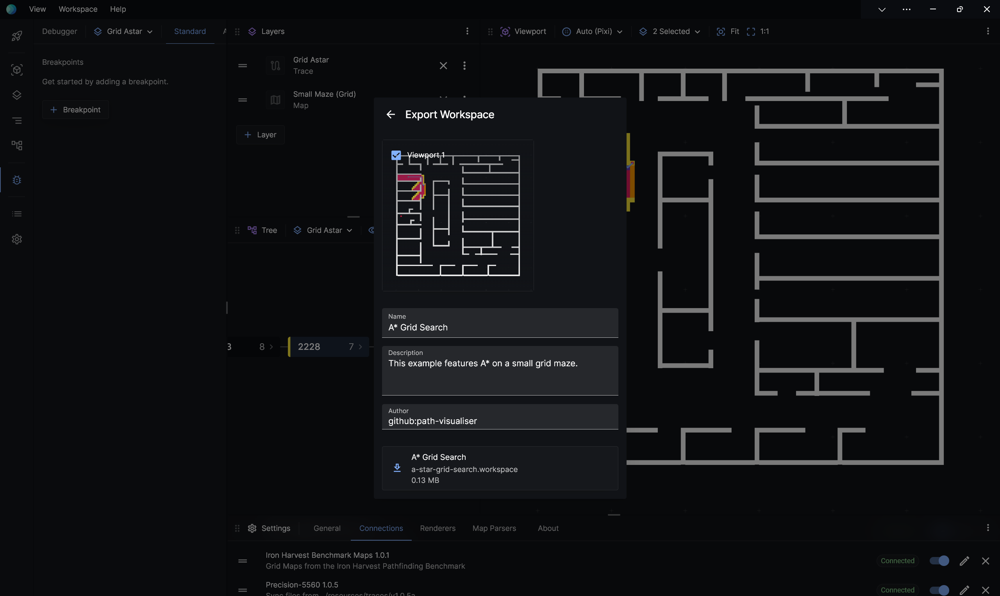
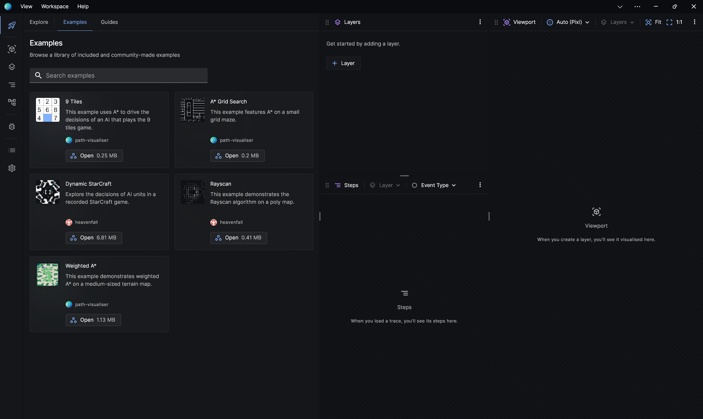
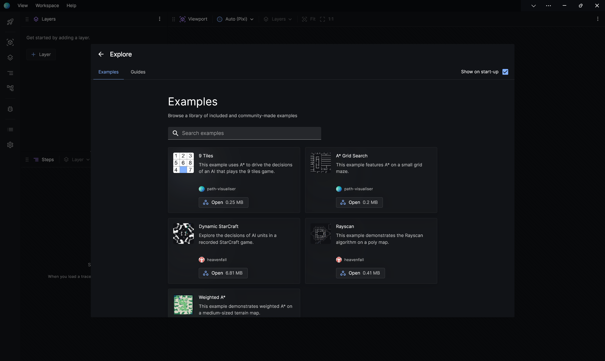
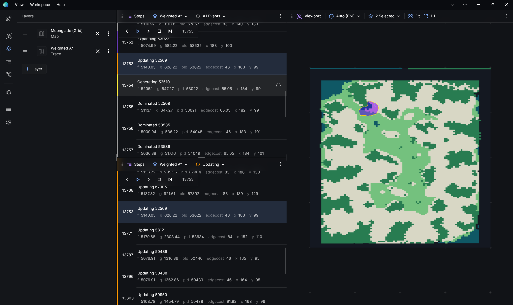
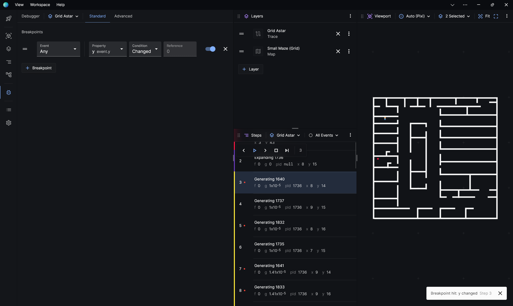

# Visualiser 1.2.0 Changes

This document describes the changes and additions from version 1.0.9-preview to version 1.2.0.

## UI

### General UI Improvements

We generally improved the UI, including the addition of a sidebar, to deliver a sleeker and more comfortable experience.

We improved the usability of the UI under different conditions like when the window gets too small.

### Empty Panel Copy

We added copy and a subtle design to panels that are empty to indicate that an action (like loading a trace) is required before they become active.

[Clip: Empty Panels](./assets/1-03-2024/1.2.0-empty-panels.mp4)

https://github.com/path-visualiser/app/assets/15244945/59d4de07-4abe-4d25-a34c-cd332f344773

### Layer Editor Panel Redesign

Previously, the layer editor is presented as a modal. It required multiple clicks to load a file and the interface is a bit confusing. In this version, the layer editor is redesigned as a popover and is significantly more usable.

[Clip: Layer Editor](./assets/1-03-2024/1.2.0-layer-panel.mp4)

https://github.com/path-visualiser/app/assets/15244945/f9d38482-8454-436b-98b2-34d92a9efc28

### Steps Panel Redesign

Previously, the playback controls tend to be hidden from immediate sight due to all controls being on the main toolbar. In this version, the playback controls are separated into their own island.

### Event Properties View

We added a way to view all of the properties of an event. This can be opened through clicking on **See All Properties** of an event in the Steps panel.

### Panel Management

We added the ability reorganise your panels by moving them around. You can do this by dragging the handle in the top left corner.

## System

### Error Handling

We introduced a per-layer error API that displays an error label when a layer encounters a problem. For example, if a map couldn't load correctly.

[Clip: Error Handling](./assets/1-03-2024/1.2.0-error-handling.mp4)

https://github.com/path-visualiser/app/assets/15244945/3e6e8131-07a9-4ea8-aff1-87647a5fbcbd

### Workspaces

We introduced a simple import/export mechanism for quickly sharing or restoring your work. This can be found in the title bar menu (**Workspace** > **Open Workspace**, **Workspace** > **Save Workspace**).

### Publish Workspaces

We designed a simple way to export your workspaces with metadata. In the future, you'll be able to upload these to a community repository.

### Drag and Drop

You can now drag and drop any assortment of files into the visualiser.

[Clip: Drag and Drop](./assets/1-03-2024/1.2.0-drag-and-drop.mp4)

https://github.com/path-visualiser/app/assets/15244945/863713c7-95d9-448e-bd80-8890bb1609e6

### Filesystem Bridge Adapter (Experimental)

To help with development and debugging workflows, we provided a way to see live update of search traces. With the right tooling, you'll be able to make changes to your code and then immediately see its visualisation. We're still refining this feature.

## Features

### Explore

We added a hub for new users to try out built-in visualisations.

For new users, this panel would display on start-up.

### Fit to Viewport

We introduced a way to fit specific layers to the viewport.

[Clip: Fit to Viewport](./assets/1-03-2024/1.2.0-fit.mp4)

https://github.com/path-visualiser/app/assets/15244945/65b6e26d-ffbb-4865-8f49-e1de250e4f62

### Filter Steps by Type

We added the ability to filter events in the Steps view by event type.

### Debugger Improvements

The debugger was updated with some new features. In the standard editor, you can now specify to break when a value changed from its parent. In the advanced editor, you now get access to `parent` and `children` variables.

## 2D Renderer

### Performance Improvements

We slightly improved perceived performance by increasing resolution when playback is paused and decreasing resolution when it is playing. We also implement dynamic framerate so the playback should feel more consistent.

https://github.com/path-visualiser/app/assets/15244945/7d14972c-e496-4763-8886-155698899c65

# Known Issues

See issues on [our bug tracker](https://github.com/path-visualiser/app/issues).

# Releases

See releases for v1.2.0 [here](https://github.com/path-visualiser/app/releases/tag/v1.2.0).
