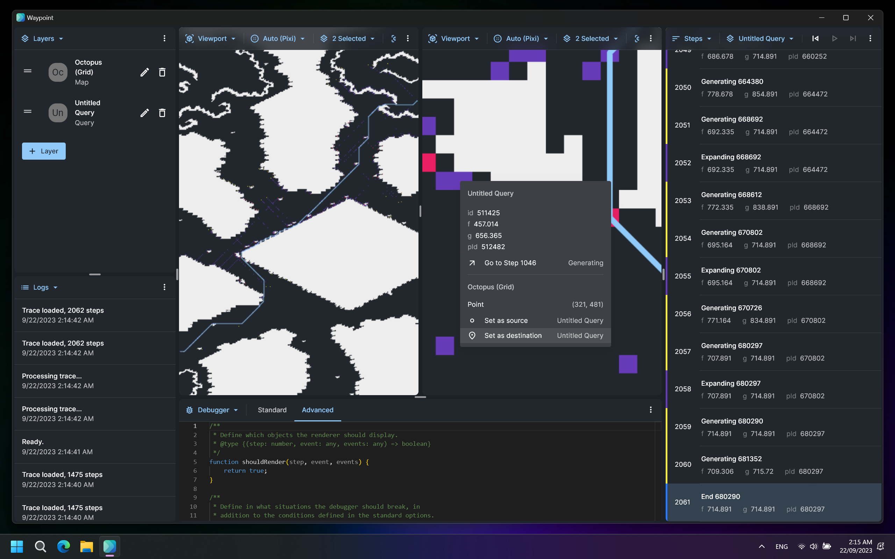
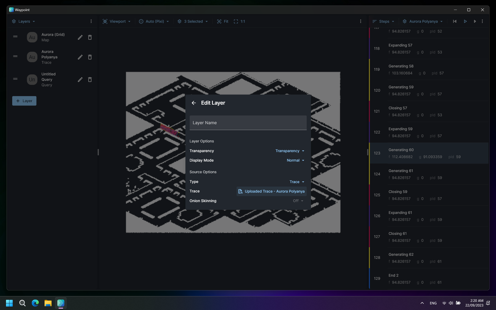
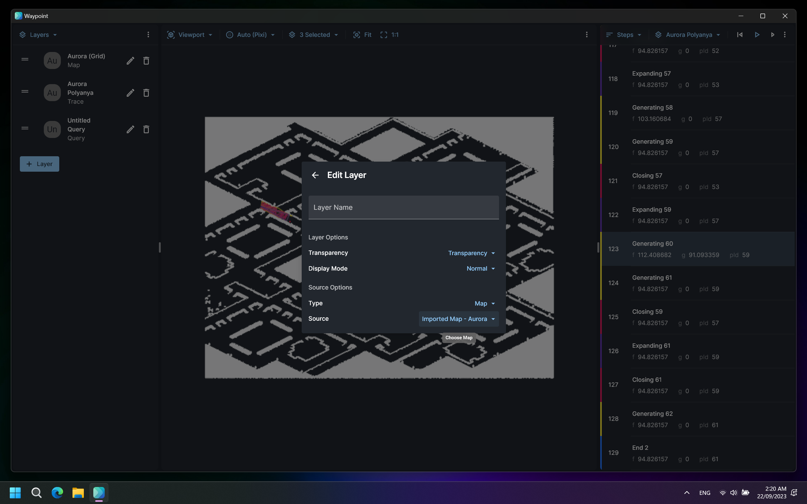
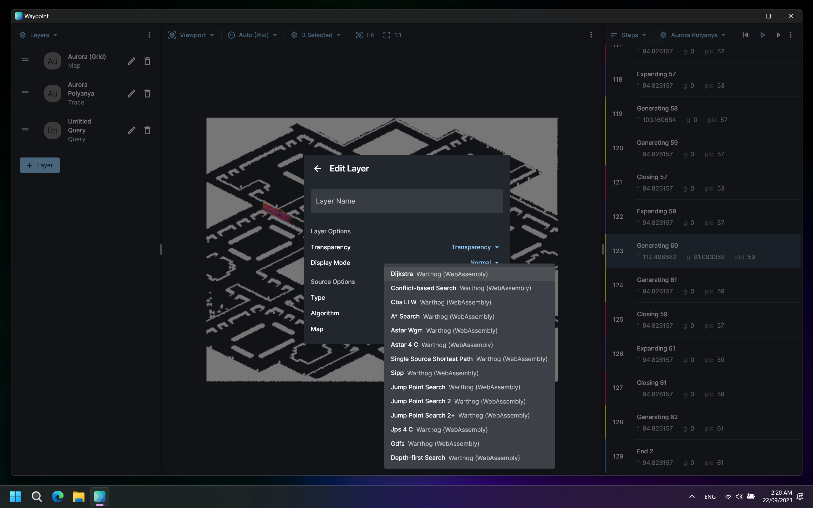
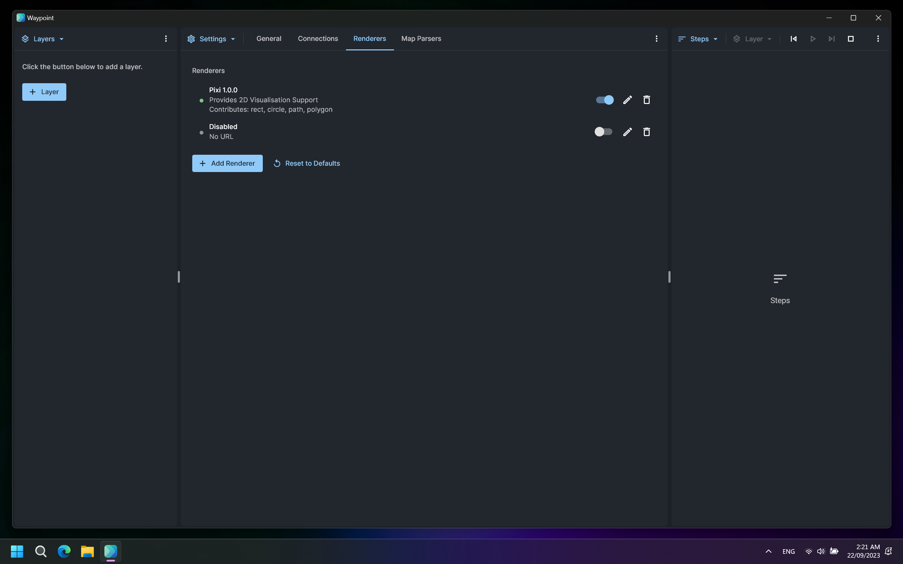
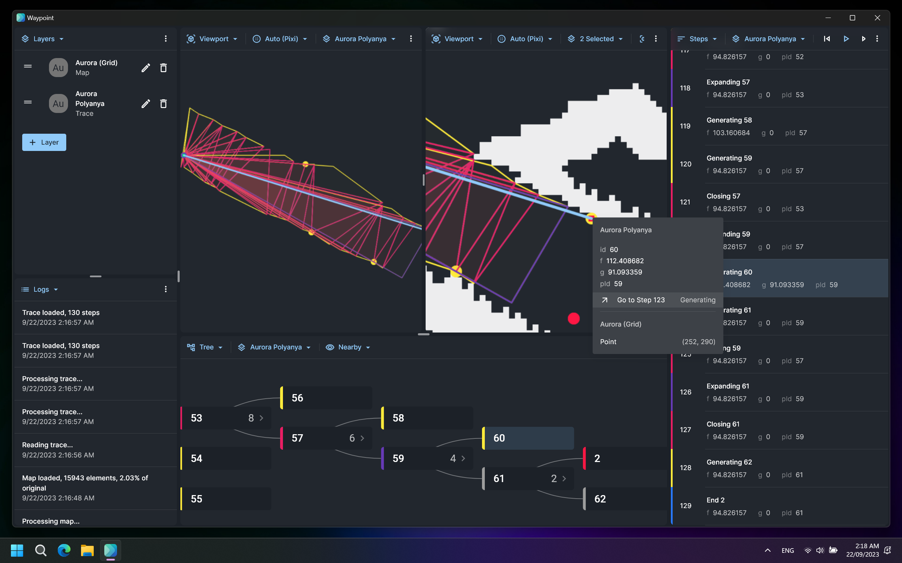
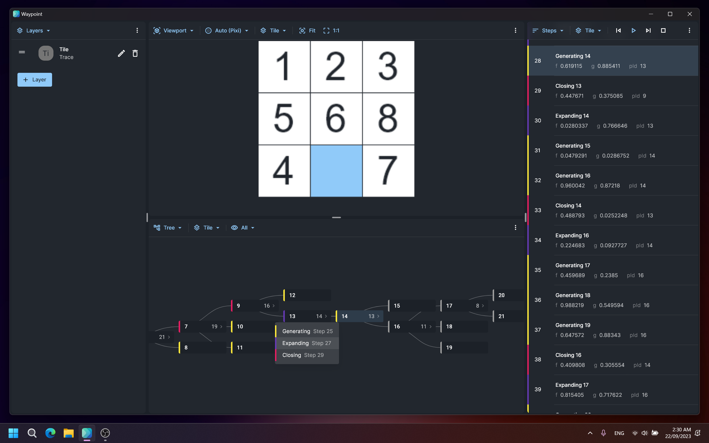

# Waypoint (PFAlgoViz) Changes

This document outlines changes made to Waypoint (previously PFAlgoViz) over time.

## September 2023

This section documents changes made from early May 2023 to late September 2023 (v1.0.4-preview).

### Architecture Changes

#### UI Overhaul

Waypoint is completely rebuilt to support dynamic and reconfigurable panels, so you can adjust the UI to fit your workflow or use case. Check out the [use cases](#use-cases) section for examples.



#### Layers

Visualise what you need by adding it as a layer to the app.

##### Trace Layer

The **Trace** layer renders a search trace. Search traces are JSON documents produced by pathfinding solvers that record steps in the search process.


##### Map Layer

The **Map** layer renders maps in a supported format.



##### Query Layer

The **Query** layer interfaces with solvers to display search traces for arbitrary problem instances.



#### Extensible Renderer System

Renderers (a.k.a. the Viewport panel) can now be added to Waypoint via extensions (the exact implementation is work-in-progress). This will allow for future renderers to be added with ease (for example, a 3D renderer).



#### Layer Panel

Manage view layers using the **Layer** panel.

#### Viewport Panel

The **Viewport** panel renders your layers by making use of an installed renderer (by default, the 2D renderer). You can choose which layers to render, as well as auto-fit the contents to the viewport, or display the contents at 1:1 scale.

#### Tree Panel

If your pathfinding search problem does not have a convenient spatial embedding (or if you just wanted to), you can also visualise any search trace in a hierarchal format with the **Tree** panel. You can choose how many nodes to render at once.

#### Steps Panel

View and replay the recorded events of the search process using the **Steps** panel.

#### Debugger Panel

Debug a search trace using the **Debugger** panel. This feature is currently non-functional in version 1.0.4.

#### Settings Panel

Manage connections to solvers and renderers in the **Settings** panel.

#### Logs Panel

Waypoint will keep a record of all alerts in the **Logs** panel.

### Features

#### 2D Renderer (Built-in)

The basic 2D renderer is built to be reliable and highly performant. Internally, it delegates rendering to background processes. The main process figures out which sections of the screen needs to be repainted (and what resolution) and requests those tiles from the subprocesses.


[Click here for full size](./assets/22-09-2023/renderer.mkv)

#### Grid, Network (XY), Poly, Mesh Map Support

There is built-in support for grid (`.grid/.map`), network (`.co/.gr/.xy`), mesh (`.mesh`), and polygon (`.poly`) map files. Conversions may be required.

|                      | Grid                                  | Network                                             | Mesh                                  | Poly          |
| -------------------- | ------------------------------------- | --------------------------------------------------- | ------------------------------------- | ------------- |
| Conversions required | Rename your `*.map` files to `*.grid` | Use `dimacs2xy` to convert `.co/.gr` files to `.xy` | Update your `.mesh` file to version 3 | None required |

#### Large Map Rendering Support

The renderer and map parser performs optimisations to handle the rendering of large maps.


[Click here for full size](./assets/22-09-2023/large-map-florida.mkv)

### Use Cases <a id="use-cases"></a>

#### Visualising a Search Trace

Load a search trace and map into Waypoint.


[Click here for full size](./assets/22-09-2023/basic.mkv)

#### Interacting with a Search Trace (Viewport, Steps and Tree)

Move around a search trace through the Viewport, Tree, and Steps panel.


[Click here for full size](./assets/22-09-2023/interactive.mkv)

#### Creative Use of the Search Trace Format (Polyanya)

The example uses the search trace format to tell the renderer to draw each event in the search process as a triangle.



#### Creative Use of the Search Trace Format (9-Tile)

This example uses the search trace format to tell the renderer how to display the current state of a 9-tile puzzle.



#### Running a Search Query

This example runs a query using Warthog (WebAssembly) over a grid map.


[Click here for full size](./assets/22-09-2023/query.mkv)

#### Comparison of Two Traces

This example compares the search process of two A\* implementations, one as a Search Trace file, and another as a query. We display these side-by-side.


[Click here for full size](./assets/22-09-2023/comparison.mkv)

### Releases

#### Waypoint Standalone (Electron) for Windows

Get Waypoint as a standalone application for Windows.

[View Releases](https://github.com/path-visualiser/app/releases)

#### Waypoint Standalone (Electron) for Linux

Get Waypoint as a standalone application for Linux.

[View Releases](https://github.com/path-visualiser/app/releases)

#### Waypoint PWA (Github Pages)

Use Waypoint in your browser, or install it as a web app.

[Open Waypoint](https://path-visualiser.github.io/app/)

#### Warthog (WebAssembly) Solver Adapter

This is the Warthog solver compiled to WebAssembly. Add this URL as a **Web Worker** connection in Waypoint (it should also be there by default).

`https://cdn.jsdelivr.net/gh/path-visualiser/app@adapter-warthog-wasm-dist/warthog-wasm.mjs`

#### Warthog (Socket.io/WebSocket) Solver Adapter

This is the Warthog solver running behind an adapter server. The adapter translates requests into Warthog problem instances, and converts Warthog output into the search trace format. The visualiser and solver communicates through a WebSocket channel.

```shell
git clone https://github.com/path-visualiser/app
cd ./app/adapter-warthog-websocket
npm i
npm start
```

Then, as prompted, add the server's URL as a **Socket.io** connection in Waypoint.

#### Iron Harvest Map Adapter

This is an example adapter that exclusively serves iron harvest grid maps to demonstrate how you could serve maps as well as run search queries.

```shell
git clone https://github.com/path-visualiser/app
cd ./app/adapter-iron-harvest
npm i
npm start
```

Then, as prompted, add the server's URL as a **Socket.io** connection in Waypoint.

### Known Issues

#### Freeze on Large Search Traces

Waypoint may freeze when the search trace contains too many steps. This is due to the inefficient way the path is currently calculated.

#### Cannot Choose Source and Destination Nodes for Queries on Network Maps

Currently, queries on the network maps will force the source and destination nodes to be `0`.
